<p align="center">
  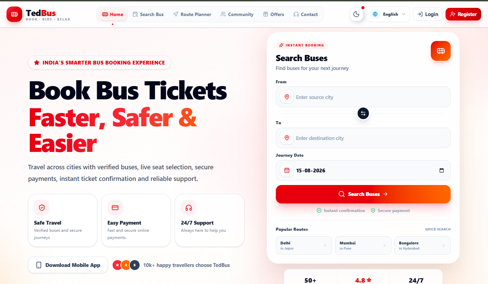
</p>
<div align="center">

# 🚌 TEDBUS

### `Smart Bus Ticket Booking & Travel Platform`

<p>
  <b>Book • Travel • Relax</b>
</p>

<p>
  A modern full-stack bus booking platform built with the MERN stack,
  featuring secure authentication, real-time notifications, online payments,
  route planning, community features and an admin dashboard.
</p>

<br/>

<a href="https://tedbus-frontend.vercel.app">
  
</a>
<a href="https://tedbus-backend-grug.onrender.com">
  
</a>
<a href="https://github.com/125Praveshyadav/TedBus">
  
</a>

<br/><br/>


</div>

---

## 🌐 Live Application

| Service | Link |
|---|---|
| 🎨 **Frontend** | [tedbus-frontend.vercel.app](https://tedbus-frontend.vercel.app) |
| ⚙️ **Backend API** | [tedbus-backend-grug.onrender.com](https://tedbus-backend-grug.onrender.com) |
| 💻 **GitHub Repository** | [github.com/125Praveshyadav/TedBus](https://github.com/125Praveshyadav/TedBus) |

> ⚡ **Note:** The backend is hosted on Render's free instance, so the first request after inactivity may take some time to wake the server.

---

# ✨ What is TedBus?

**TedBus** is a full-stack bus ticket booking platform designed to provide a complete digital travel experience.

Users can:

- 🔍 Search buses
- 🚌 View bus details
- 💺 Select seats
- 👤 Add passenger information
- 💳 Make online payments
- 🎟️ Generate digital tickets
- 📋 Manage bookings
- ⭐ Rate and review buses
- 🔔 Receive notifications
- 🌍 Plan routes
- 💾 Save routes
- 👥 Participate in community discussions
- 🌙 Use Dark Mode

The platform also provides an **Admin Dashboard** for managing the complete booking ecosystem.

---

# 🎯 Why TedBus?

TedBus is not just a basic CRUD project.

It combines multiple real-world application concepts:

```text
Authentication
      ↓
Bus Search
      ↓
Seat Management
      ↓
Booking System
      ↓
Payment Gateway
      ↓
Ticket Generation
      ↓
Real-Time Notifications
      ↓
Reviews & Community
      ↓
Route Planning
      ↓
Admin Management
```

---

# 🚀 Core Features

<table>
<tr>
<td width="50%">

### 🔐 Authentication
- JWT Authentication
- Email OTP Verification
- Login / Register
- Forgot Password
- Reset Password
- Protected Routes
- Admin Authentication
- Password Hashing

</td>

<td width="50%">

### 🚌 Bus Booking
- Search Buses
- Source / Destination
- Travel Date
- Bus Details
- Filters
- Sorting
- Seat Selection
- Passenger Information

</td>
</tr>

<tr>
<td>

### 💳 Payments
- Razorpay Integration
- Payment Verification
- Booking Confirmation
- Payment Records
- Secure Payment Flow

</td>

<td>

### 🎟️ Ticket System
- Digital Ticket
- Booking History
- Ticket Details
- QR Code Support
- PDF Generation

</td>
</tr>

<tr>
<td>

### 🔔 Notifications
- Real-Time Notifications
- Socket.IO
- Notification Preferences
- Booking Notifications
- Reminder Jobs
- Retry Failed Notifications

</td>

<td>

### 🌍 Route Planner
- Interactive Maps
- TomTom Maps API
- Route Planning
- Saved Routes
- Travel Route Information

</td>
</tr>

<tr>
<td>

### 👥 Community
- Posts
- Comments
- Likes
- Forums
- Discussions
- Replies
- Saved Posts
- Reports

</td>

<td>

### ⭐ Reviews
- Ratings
- Reviews
- Review Management
- User Feedback
- Admin Moderation

</td>
</tr>

<tr>
<td>

### 🎫 Offers
- Coupons
- Discounts
- Active Coupon Validation
- Coupon Management

</td>

<td>

### 🛠️ Admin Dashboard
- Bus Management
- User Management
- Booking Management
- Coupon Management
- Reviews
- Reports
- Community Moderation

</td>
</tr>
</table>

---

# 🎨 User Experience

TedBus is designed with a modern and responsive interface.

### 🌙 Dark Mode

The application supports a persistent dark mode experience for better usability.

### 📱 Responsive Design

The UI is designed to work across:

```text
💻 Desktop
📱 Mobile
📟 Tablet
```

### 🌍 Internationalization

The application includes multilingual support using:

```text
i18next
react-i18next
i18next-browser-languagedetector
```

---
# 🖼️ Application Preview

## 🏠 Home Page

<p align="center">
  
</p>

---

## 🔎 Search Buses

<p align="center">
  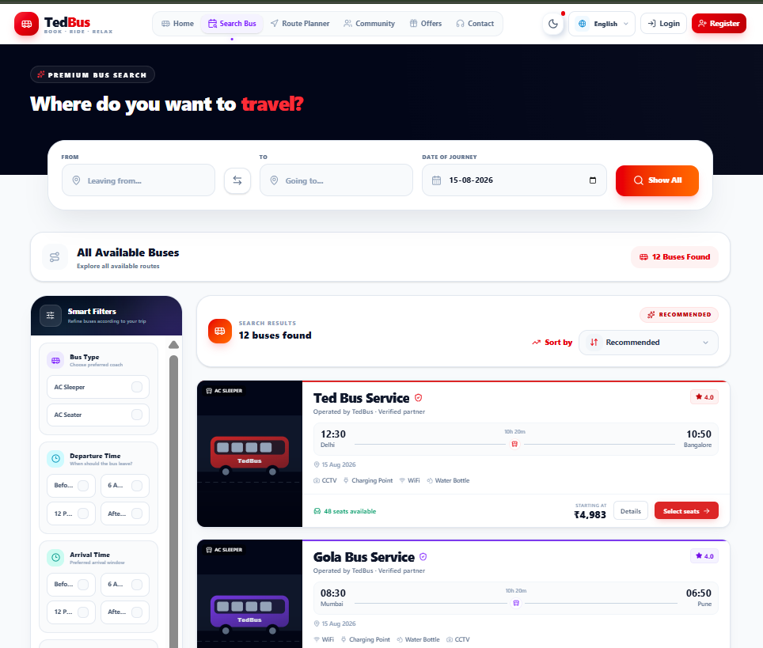
</p>

---

## 🚌 Bus Details

<p align="center">
  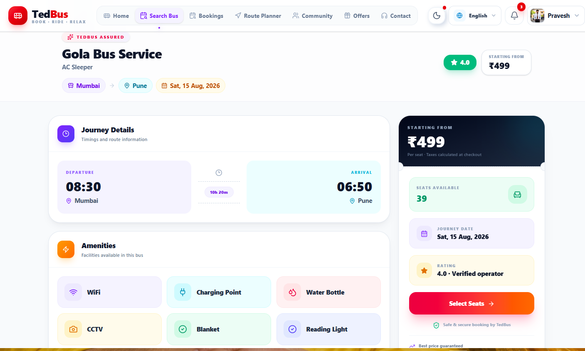
</p>

---

## 💺 Seat Selection

<p align="center">
  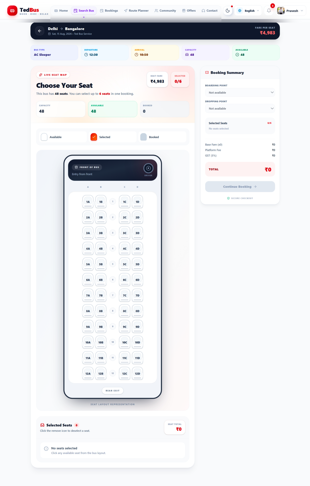
</p>

---

## 🎫 Booking

<p align="center">
  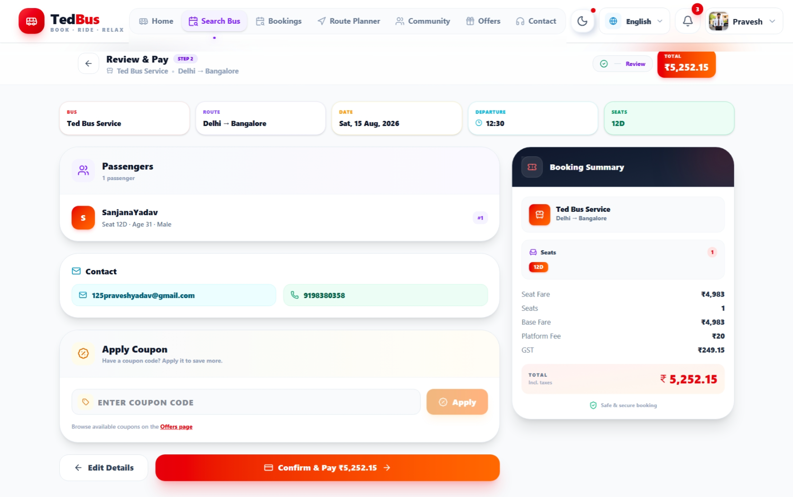
</p>

---

## 💳 Payment

<p align="center">
  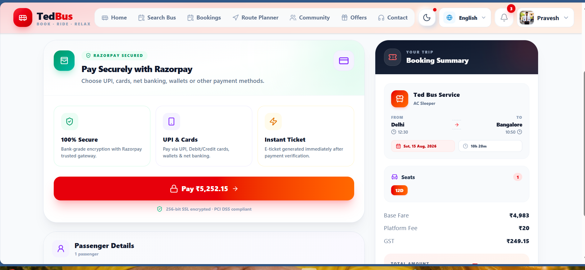
</p>

---

## 🔔 Notifications

<p align="center">
  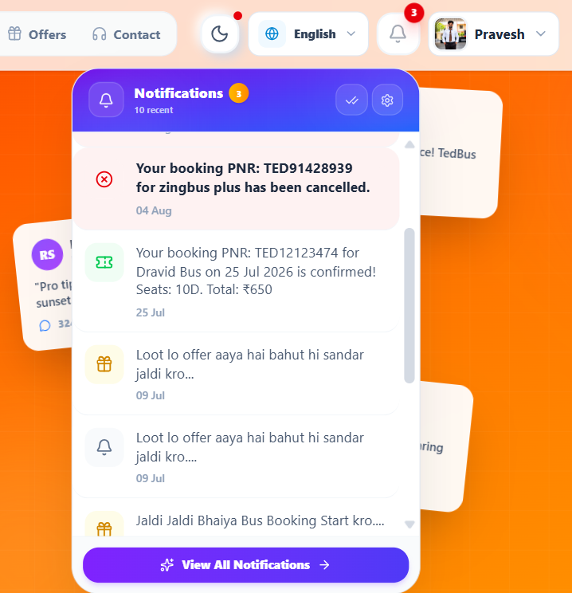
</p>

---

## 🎁 Offers

<p align="center">
  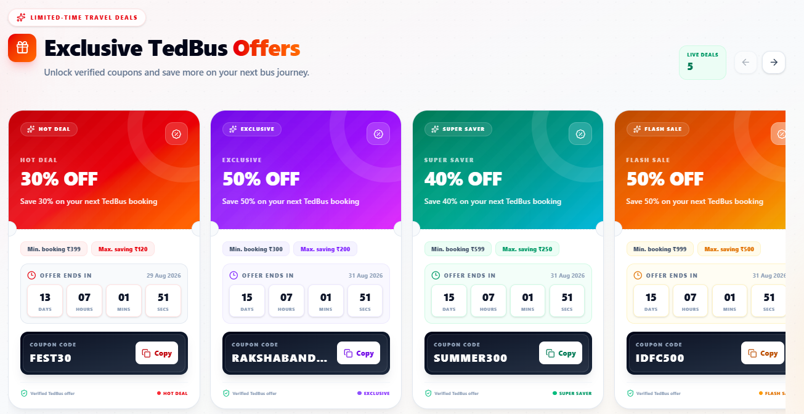
</p>

---

## 🗺️ Route Planner

<p align="center">
  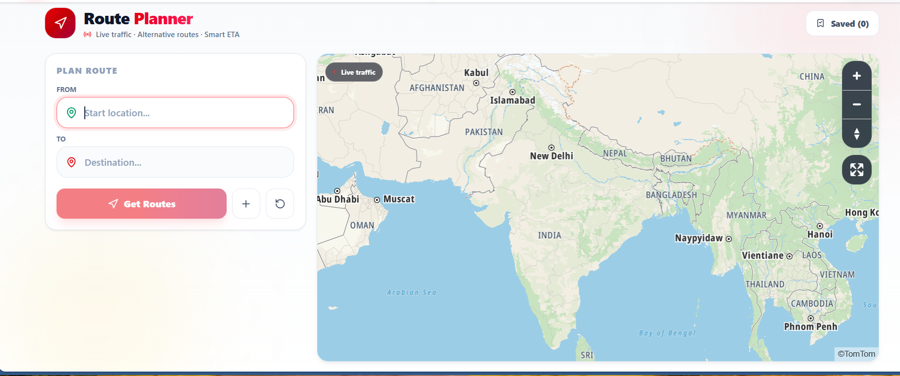
</p>

---

## 👥 Community

<p align="center">
  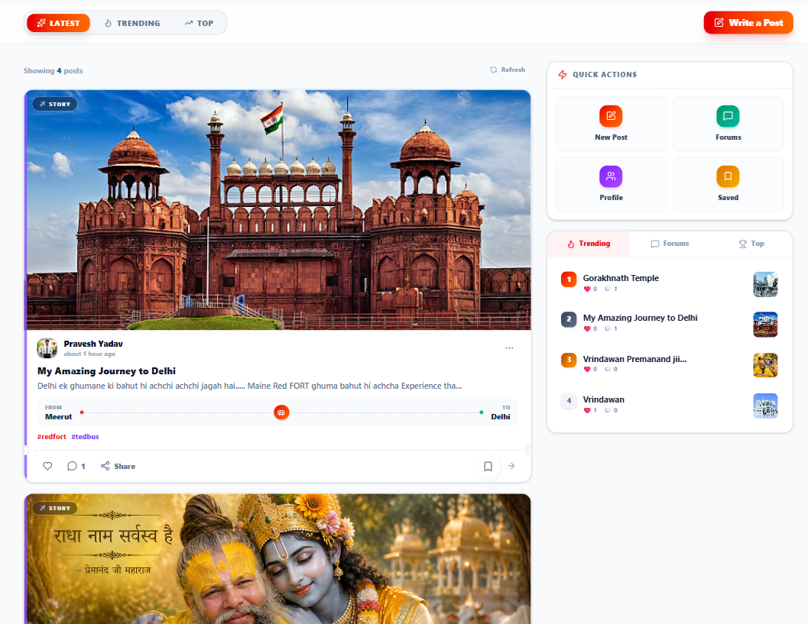
</p>

---

## 🛠️ Admin Dashboard

<p align="center">
  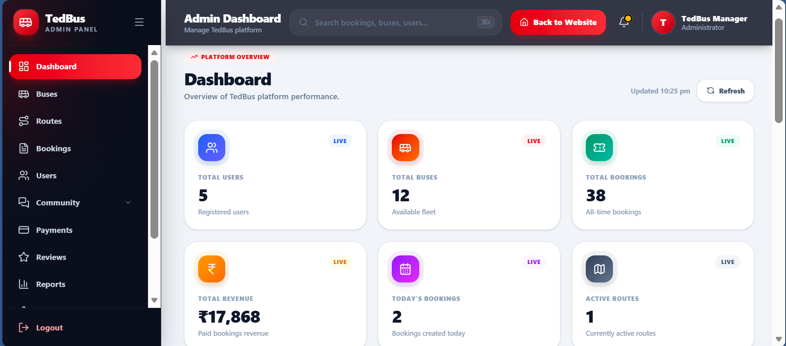
</p>

# 🧰 Tech Stack

## 🎨 Frontend

| Technology | Purpose |
|---|---|
| React.js | UI Development |
| Vite | Frontend Build Tool |
| Tailwind CSS | Styling |
| React Router | Routing |
| Context API | State Management |
| Axios | API Communication |
| Socket.IO Client | Real-Time Communication |
| React Toastify | Notifications |
| i18next | Internationalization |
| TomTom Maps | Route Planning |
| Razorpay | Payments |
| QR Code | Ticket Generation |
| jsPDF | PDF Generation |

---

## ⚙️ Backend

| Technology | Purpose |
|---|---|
| Node.js | Runtime |
| Express.js | REST API |
| MongoDB | Database |
| Mongoose | ODM |
| JWT | Authentication |
| bcryptjs | Password Hashing |
| Socket.IO | Real-Time Communication |
| Nodemailer | Email |
| Cloudinary | Media Storage |
| Multer | File Upload |
| Node-Cron | Scheduled Jobs |
| Helmet | Security |
| Express Rate Limit | API Protection |
| Joi / Express Validator | Validation |
| Razorpay | Payment Processing |

---

# 🏗️ System Architecture

<p align="center">

```text
                         👤 USER
                           │
                           │ HTTPS
                           ▼
              ╭──────────────────────────╮
              │      ⚛️ TEDBUS APP       │
              │                          │
              │  React + Vite + Tailwind │
              ╰────────────┬─────────────╯
                           │
                  REST API + Socket.IO
                           │
                           ▼
              ╭──────────────────────────╮
              │     ⚙️ BACKEND API       │
              │                          │
              │   Node.js + Express.js   │
              ╰────────────┬─────────────╯
                           │
              ┌────────────┼────────────┐
              │            │            │
              ▼            ▼            ▼
       ╭────────────╮ ╭────────────╮ ╭──────────────╮
       │ 🍃 MongoDB │ │ 🔌 Socket  │ │ ☁️ Services  │
       │   Atlas    │ │    .IO     │ │              │
       │            │ │            │ │ 💳 Razorpay  │
       │ Database   │ │ Real-time  │ │ 🗺️ TomTom    │
       ╰────────────╯ ╰────────────╯ │ ☁️ Cloudinary│
                                     │ 📧 Nodemailer│
                                     ╰──────────────╯

# 🔄 Booking Flow

```text
┌──────────────┐
│ Search Bus   │
└──────┬───────┘
       ↓
┌──────────────┐
│ Select Bus   │
└──────┬───────┘
       ↓
┌──────────────┐
│ Select Seats │
└──────┬───────┘
       ↓
┌───────────────┐
│ Passenger Info│
└──────┬────────┘
       ↓
┌──────────────┐
│ Booking       │
│ Summary       │
└──────┬───────┘
       ↓
┌──────────────┐
│ Razorpay 💳  │
└──────┬───────┘
       ↓
┌──────────────────┐
│ Payment Verify   │
└──────┬───────────┘
       ↓
┌──────────────────┐
│ Booking Confirmed│
└──────┬───────────┘
       ↓
┌──────────────────┐
│ Digital Ticket 🎟️│
└──────────────────┘
```

---


# 🗄️ Database Design

TedBus uses **MongoDB Atlas**.

### Main Collections

```text
users
│
├── buses
├── bookings
├── payments
├── coupons
├── reviews
│
├── notifications
├── notificationpreferences
│
├── posts
├── comments
├── likes
├── forums
├── discussions
├── replies
├── reports
│
├── routes
├── savedroutes
├── savedposts
│
├── settings
└── otps
```

---


# 🔌 API Modules

```text
/api/v1/auth
/api/v1/users
/api/v1/buses
/api/v1/bookings
/api/v1/coupons
/api/v1/admin
/api/v1/reviews
```

Additional backend modules handle:

```text
🔔 Notifications
💳 Payments
👥 Community
🗺️ Routes
⭐ Reviews
🎫 Coupons
```

---

# 🔐 Security

TedBus implements several security practices:

```text
🔒 JWT Authentication
🔑 Password Hashing
🛡️ Helmet Security Headers
🚦 Rate Limiting
✅ Request Validation
🔐 Protected Routes
🍪 Secure Cookies
🌐 CORS Configuration
```

> **Important:** Never commit `.env`, `config.env`, API keys, database passwords or other secrets to GitHub.

---

# ⚙️ Local Installation

## 1️⃣ Clone Repository

```bash
git clone https://github.com/125Praveshyadav/TedBus.git

cd TedBus
```

---

## 2️⃣ Backend

```bash
cd tedbus-backend

npm install

npm run dev
```

Backend:

```text
http://localhost:5000
```

---

## 3️⃣ Frontend

Open another terminal:

```bash
cd tedbus-frontend

npm install

npm run dev
```

Frontend:

```text
http://localhost:5173
```

---

# 🔑 Environment Variables

### Backend `config.env`

```env
PORT=5000

MONGO_URI=*****************

FRONTEND_URL=

JWT_SECRET=

RAZORPAY_KEY_ID=
RAZORPAY_KEY_SECRET=

EMAIL_USER=
EMAIL_PASS=

CLOUDINARY_CLOUD_NAME=
CLOUDINARY_API_KEY=
CLOUDINARY_API_SECRET=
```

### Frontend `.env`

```env
VITE_API_BASE_URL=

VITE_SOCKET_URL=

VITE_RAZORPAY_KEY_ID=razorpay_key

VITE_TOMTOM_API_KEY=_tomtom_api_key
```

---

# 🚀 Deployment

TedBus uses a separate deployment architecture.

```text
                    GitHub
                      │
              ┌───────┴────────┐
              │                │
              ▼                ▼
         ▲ Vercel           Render
              │                │
              ▼                ▼
       React Frontend     Node Backend
              │                │
              └───────┬────────┘
                      │
                      ▼
                MongoDB Atlas
```

### Frontend

```text
Vercel
   ↓
React + Vite
   ↓
tedbus-frontend.vercel.app
```

### Backend

```text
Render
   ↓
Node + Express
   ↓
tedbus-backend-grug.onrender.com
```

### Database

```text
MongoDB Atlas
```

---


# 📊 Project Highlights

<div align="center">

| 🚀 Feature | ⚡ Technology |
|---|---|
| Frontend | React + Vite |
| UI | Tailwind CSS |
| Backend | Node.js + Express |
| Database | MongoDB Atlas |
| Authentication | JWT + OTP |
| Payment | Razorpay |
| Real-Time | Socket.IO |
| Maps | TomTom |
| Media | Cloudinary |
| Email | Nodemailer |
| Frontend Hosting | Vercel |
| Backend Hosting | Render |

</div>

---

# 💡 What I Learned

Building TedBus helped me work with real-world full-stack concepts including:

- REST API architecture
- Authentication & authorization
- JWT-based security
- MongoDB schema design
- Payment gateway integration
- Real-time WebSocket communication
- Email services
- Scheduled background jobs
- API validation
- CORS configuration
- Production deployment
- Vercel + Render integration
- MongoDB Atlas migration
- Environment configuration
- Responsive UI development

---

# 👨‍💻 Developer

<div align="center">

## Pravesh Yadav

**B.Tech CSE | Full-Stack Developer | Java & DSA Enthusiast**

I build full-stack web applications and enjoy solving  
Data Structures & Algorithms problems using Java.

<br/>

<a href="https://github.com/125Praveshyadav">

</a>

<a href="https://www.linkedin.com/in/pravesh-yadav-99b6a3312/">

</a>

<a href="https://leetcode.com/u/PraveshDSA/">

</a>

</div>

---

# ⭐ Support the Project

If you like **TedBus**, consider giving this repository a ⭐.

It really helps and motivates me to keep improving the project.

<div align="center">

### 🚌 TEDBUS

**Search • Book • Pay • Travel**

<br/>

`Built with React + Node.js + MongoDB`

<br/>

⭐ **Star the repository if you found it useful!** ⭐

</div>                  
